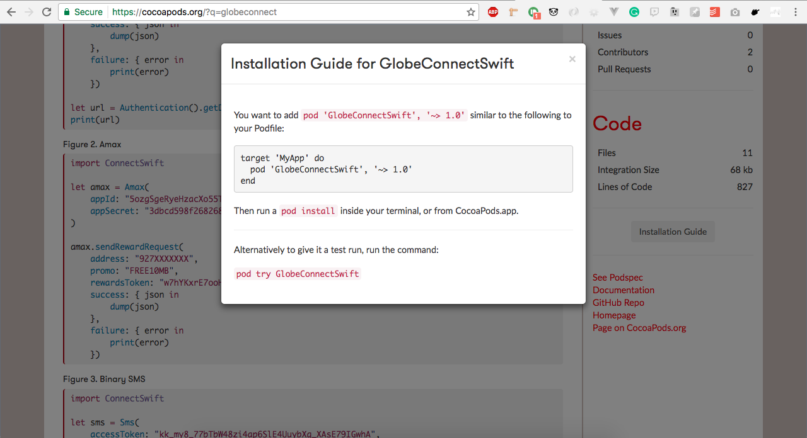
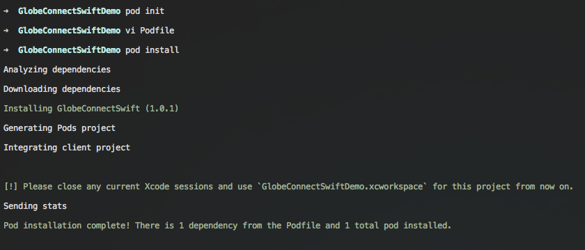

# Installing the SDK via Cocoapods.

Below are the step by step procedure on how to install the SDK via Cocoapods on your new or
existing project manually, below also shows the list of the requirements for the SDK to work properly.

## Requirements

- Ruby
- XCode >= 8
- Swift >= 3.0
- Cocoapods

#### Installation

If you're going to install the Swift package via Cocoapods, make sure that your project is a
XCode Project.

Once you have a newly created or existing XCode project, fire up your terminal and `cd` to your
project directory then type `pod init` to setup a `Podfile` in your project directory.

Open up your browser and go to [Cocoapods page of the SDK](https://cocoapods.org/pods/GlobeConnectSwift)
and look up for the installation guide.

Follow the instructions and once you have fired up `pod install` your output should be like this to
confirm that you have successfully installed the SDK.

After that you're good to go.
